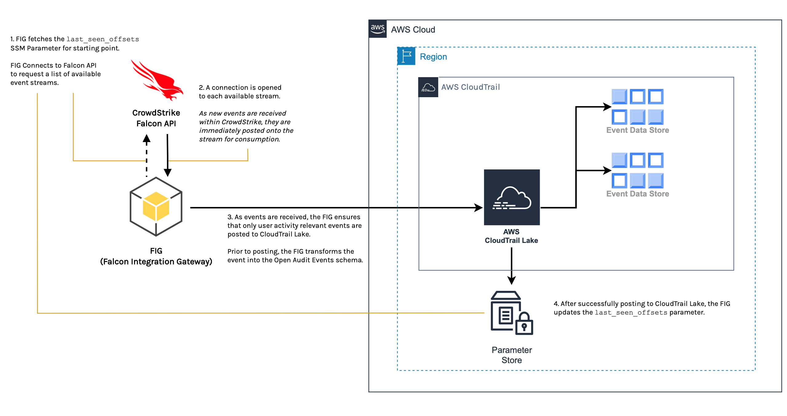

# AWS CloudTrail Lake Integration
AWS and CrowdStrike teamed to deliver this integration for AWS CloudTrail Lake that allows you to simplify and streamline the process of consolidating activity data from CrowdStrike Falcon. This integration enables enhanced visibility across environments and applications.

## Table of Contents
* [Overview](#overview)
  * [Architecture](#architecture)
  * [Data Flow](#data-flow)
* [Getting Started](#getting-started)
  * [Prerequisites](#prerequisites)
  * [Create IAM Role](#create-iam-role)
  * [Deployment Strategies](#deployment-strategies)
## Overview
This integration provides CrowdStrike Falcon and AWS CloudTrail Lake consumers the ability to log and store
user activity data from CrowdStrike Falcon using AWS CloudTrail Open Audit Events. This is accomplished by tapping
into the CrowdStrike Falcon *event-stream* API, watching for relevant user activity events, and then publishing
these events to AWS CloudTrail Lake.

### Architecture
The AWS CloudTrail Lake integration consists of the following components:
* The Falcon Integration Gateway Python application used for ingesting events from the CrowdStrike API
  > This application is commonly referred to as the FIG
* AWS SSM Parameter Store
  > This is used to keep track of event offsets with the `last_seen_offsets` parameter. This parameter
  will be created for you and used to prevent sending duplicate events.
* AWS CloudTrail Lake - Event Data Store(s)
  > The FIG requires a Channel ARN in order to route the events to the correct EDS.



### Data Flow
1. The FIG application fetches the `last_seen_offsets` SSM parameter to ensure duplicate events aren't sent. The FIG then contacts the CrowdStrike Falcon API to request a list of available event streams.
    > If the `last_seen_offsets` SSM parameter does not exist, it will be created the first time it is ran.
2. A connection is opened to each available event stream. As new events are received within CrowdStrike,
these events are published to the event stream, which are then consumed by the FIG application.
3. The FIG application:
    1. Filters events as they are received.
        > Only events designated as user activity data is passed through.
    2. Transforms events into the AWS CloudTrail Open Audit Events schema.
    3. Publishes transformed events into AWS CloudTrail Lake.
        > The destination is determined by the *Channel* resource from creating an Event Data Store in
        AWS CloudTrail Lake.
4. As events are successfully published to CloudTrail Lake, the FIG updates the `last_seen_offsets` SSM parameter.
----------

## Getting Started
### Prerequisites:
* Have a current CrowdStrike Subscription
* Have appropriate AWS permissions to run CloudFormation and/or create resources
* The Channel ARN from the CrowdStrike Partner Integration in AWS CloudTrail Lake
  > This sets up the Channel used to ingest events.
- Have a CrowdStrike API Key Pair

    This key pair will be used to read falcon events and supplementary information from CrowdStrike Falcon.
    > If you need to create a new API key pair, review our docs: [CrowdStrike Falcon](https://falcon.crowdstrike.com/support/api-clients-and-keys).

    Make sure only the following permissions are assigned to the key pair:
    * Event streams: READ
    * Hosts: READ

### Create IAM Managed Policy
In order to use this integration, create an IAM Managed Policy using the Channel ARN to send data to
CloudTrail Lake.

Below are 2 ways to accomplish this:
- A [CloudFormation template](./assets/cs-integration-policy.yaml)
    > The Policy ARN is an output
- Or, you can manually create a Managed Policy with the following permissions:
    ```json
    {
        "Version": "2012-10-17",
        "Statement": [
            {
                "Action": "cloudtrail-data:PutAuditEvents",
                "Resource": "<Channel ARN>",
                "Effect": "Allow"
            },
            {
                "Action": [
                    "ssm:PutParameter",
                    "ssm:GetParameter"
                ],
                "Resource": "*",
                "Effect": "Allow"
            }
        ]
    }
    ```

    > **Make note of the Policy ARN after policy is created**

## Deployment Strategies
Regardless of which deployment method you choose, the following values should be known ahead of time:

- ***Falcon API Credentials***:
    - Falcon Client ID
    - Falcon Client Secret
    - Falcon Client Region
- ***CloudTrail Lake***:
    - Channel ARN
    - AWS Region associated with the Channel

**Prior to Deployment, please familiarize yourself with the available FIG [Configuration](https://github.com/CrowdStrike/falcon-integration-gateway/tree/main/config) options.**


### [Deployment to EKS](https://github.com/CrowdStrike/falcon-integration-gateway/tree/main/docs/cloudtrail-lake/eks)
> Deploy FIG on EKS with Helm chart or Kube spec
### [Manual Deployment](https://github.com/CrowdStrike/falcon-integration-gateway/tree/main/docs/cloudtrail-lake/manual)
> Deploy FIG via Docker
