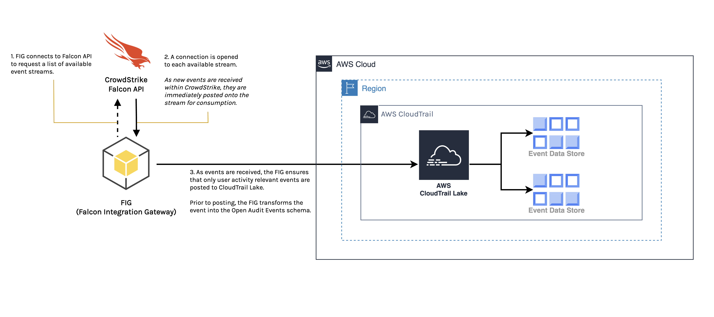

# AWS CloudTrail Lake Integration
Publish security relevant audit events identified by CrowdStrike Falcon to AWS CloudTrail Lake.

## Table of Contents
+ [Overview](#overview)
  + [Architecture](#architecture)
  + [Data Flow](#data-flow)
+ [Getting Started](#getting-started)
  + [Requirements](#requirements)
  + [Configuration](#configuring-the-application)
+ [Troubleshooting](#troubleshooting)
## Overview
This integration provides CrowdStrike Falcon and AWS CloudTrail Lake consumers the ability to log and store
user activity data from CrowdStrike Falcon using AWS CloudTrail Open Audit Events. This is accomplished by tapping
into the CrowdStrike Falcon *event-stream* API, watching for relevant user activity events, and then publishing
these events to AWS CloudTrail Lake.

### Architecture
The AWS CloudTrail Lake integration consists of one primary component:
* The Falcon Integration Gateway Python application used for ingesting events from the CrowdStrike API
  > This application is commonly referred to as the FIG

### Data Flow
1. The FIG application contacts the CrowdStrike Falcon API to request a list of available event streams.
2. A connection is opened to each available event stream. As new events are received within CrowdStrike,
these events are published to the event stream, which are then consumed by the FIG application.
3. The FIG application:
    1. Filters events as they are received.
        > Only events designated as user activity data is passed through.
    2. Transforms events into the AWS CloudTrail Open Audit Events schema.
    3. Publishes transformed events into AWS CloudTrail Lake.
        > The destination is determined by the *Channel* resource from creating an Event Data Store in
        AWS CloudTrail Lake.
----------

## Getting Started

### Prerequisites:
* Have a current CrowdStrike Subscription
* A CrowdStrike partner integration in AWS CloudTrail Lake

### Deployment
The Deployment guide for this integration is hosted in the [Falcon Integration Gateway](https://github.com/CrowdStrike/Falcon-Integration-Gateway) repository.
> The 
